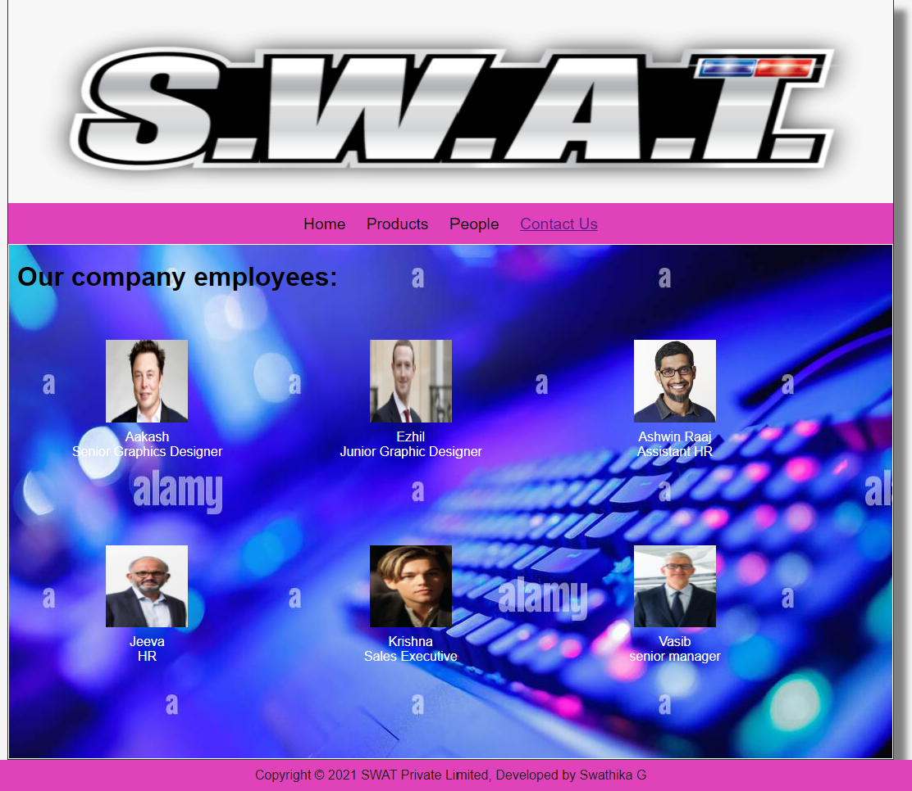

# Web Design for a Software Product Company

## AIM:

To design a static website for a software product company company.

## DESIGN STEPS:

### Step 1:

Requirement collection.

### Step 2:

Creating the layout using HTML and CSS.

### Step 3:

Updating the sample content.

### Step 4:

Choose the appropriate style and color scheme.

### Step 5:

Validate the layout in various browsers.

### Step 6:

Validate the HTML code.

### Step 6:

Publish the website in the given URL.

## PROGRAM :
Layout.css:
```
* {
  box-sizing: border-box;
  font-family: Arial, Helvetica, sans-serif;
}
body {
  background-color: whitesmoke;
  color: #17421d;
}
.container {
  width: 1080px;
  margin-left: auto;
  margin-right: auto;
  border-width: 1px 1px 1px 1px;
  border-style: solid;
  box-shadow: 15px 15px 8px gray;
}

.banner {
  display: block;
  width: 100%;
  height: 250px;
  text-align: center;
  font-size: 60px;
  background-image: url("/static/img/SW.png");
  background-size: 100% 100%;
  margin: 0px 0px 0px 0px;
  padding-top: 150px;
  color: #16d1ae;
}

.menu {
  display: block;
  width: 100%;
  height: 50px;
  font-size: larger;
  background-color:#e043b9;
  text-align: center;
  padding-top: 15px;
  margin: 0px 0px 0px 0px;
  border-width: 1px;
}

.menuitem {
  display: inline-block;
  margin-left: 10px;
  margin-right: 10px;
}
.menuitemselected {
  display: inline-block;
  margin-left: 10px;
  margin-right: 10px;
  color: #16d1ae;
}

.menuitem a {
  text-decoration: none;
  color: #030303;
}

.content {
  display: block;
  width: 100%;
  background-image: url("/static/img/ddd.jpg");
  margin: 0px 0px 0px 0px;
  border-width: 1px;
  border-color: white;
  border-style: solid;
}
.homecontent {
  min-height: 500px;
  margin: 10px 10px 10px 10px;
}
.homecontent h1 {
  text-align: left;
  color: black;
}
.homecontent img {
  float: right;
  width: 400px;
  height: 300px;
  margin-left: 10px;
}

.contenttext {
  text-align: justify;
  color: white;
  font-family: bold;
  font-size: large;
}

.productcontent {
  min-height: 500px;
  margin: 10px 10px 10px 10px;
}

.productcontent h1 {
  text-align: left;
  color: black;
}

.productitems {
  display: block;
}

.productitem {
  display: inline-block;
  width: 30%;
  height: 250px;
  text-align: center;
}

.productitem img {
  width: 100px;
  height: 100px;
  display: block;
}
.productitem .itemimage {
  display: inline-block;
  margin-left: auto;
  margin-right: auto;
  width: 100px;
  margin-bottom: 5px;
  color: white;
}

.productitem .itemname {
  display: block;
  color: white;
}
.productitem .itemprice {
  display: block;
  color: white;
}

.footer {
  display: block;
  width: 100%;
  height: 40px;
  background-color: #e043b9;
  text-align: center;
  padding-top: 10px;
  margin: 0px 0px 0px 0px;
  color: #161616;
}

```
Home Page:
```
<html lang="en">
    <head>
      <title>SWAT Private Limited</title>
      <link rel="stylesheet" href="./css/layout.css" />
      <link rel="icon" href="./img/icon.png" type="image/x-icon" />
    </head>
  
    <body>
      <div class="container">
        <div class="banner"></div>
        <div class="menu">
          <div class="menuitem"><a href="/static/home.html">Home</a></div>
          <div class="menuitem"><a href="/static/products.html">Products</a></div>
          <div class="menuitem"><a href="/static/people.html">People</a></div>
          <div class="menuitemselected"><a href="/static/contactus.html">Contact Us</a></div>
          </div>
        <div class="content">
          <div class="homecontent">
            <h1>About Us</h1>
            <div class="contenttext">
              An online game is a video game that is either partially or 
              primarily played through the Internet or any other computer network available.
              Online games are ubiquitous on modern gaming platforms, including PCs, consoles
              and mobile devices, and span many genres, including first-person shooters, 
              strategy games, and massively multiplayer online role-playing games (MMORPG).
              In 2019, revenue in the online games segment reached $16.9 billion, 
              with $4.2 billion generated by China and $3.5 billion in the United States.
              Since 2010s, a common trend among online games has been operating them as 
              games as a service, using monetization schemes such as loot boxes and
              battle passes as purchasable items atop freely-offered games.
              Unlike purchased retail games, online games have the problem of
              not being permanently playable, as they require special servers in order to function.
             <br><br>
             
             <div class="contenttext">
              The design of online games can range from simple text-based environments to the
              incorporation of complex graphics and virtual worlds.The existence of 
              online components within a game can range from being minor features, such as an
              online leaderboard, to being part of core gameplay, such as directly playing 
              against other players. Many online games create their own online communities, 
              while other games, especially social games, integrate the players' existing 
              real-life communities.Some online games can receive a 
              massive influx of popularity due to many well-known Twitch streamers and YouTubers playing them.

              <ul>
                <li>Improves interaction and concentration</li>
                <li>Helps to improve analytical skills</li>
                <li>Anywhere, anytime and secure access</li>
              </ul>
            </div>
          </div>
        </div>
        <div class="footer">
          Copyright &#169; 2021 SWAT Private Limited, Developed by Swathika G
        </div>
      </div>
    </body>
  </html>
  
```
Product Page:
```
<!DOCTYPE html>
<html lang="en">
  <head>
    <title>SWAT Private Limited</title>
    <link rel="stylesheet" href="./css/layout.css" />
    <link rel="icon" href="./img/icon.png" type="image/x-icon" />
  </head>

  <body>
    <div class="container">
      <div class="banner"></div>
      <div class="menu">
        <div class="menuitem"><a href="/static/home.html">Home</a></div>
        <div class="menuitem"><a href="/static/products.html">Products</a></div>
        <div class="menuitem"><a href="/static/people.html">People</a></div>
        <div class="menuitemselected"><a href="/static/contactus.html">Contact Us</a></div>
        </div>
      <div class="content">
        <div class="productcontent">    
          <h1>Our Premium Products</h1>
          <div class="productitems">
              <div class="productitem"> 
                  <div class="itemimage">
                  
                  </div>
                  <div class="itemname">Candy Crush Saga</div>
                  <div class="itemprice">Price: Rs.400.00 </div>
              </div>
              <div class="productitem"> 
                  <div class="itemimage">
                  
                  </div>
                  <div class="itemname">Swat VS Zombies</div>
                  <div class="itemprice">Price: Rs.250.00 </div>
              </div>
              <div class="productitem"> 
                <div class="itemimage">
                
                </div>
                <div class="itemname">Kingdom Defence</div>
                <div class="itemprice">Price: Rs.100.00 </div>
            </div>
            <div class="productitem"> 
              <div class="itemimage">
              
              </div>
              <div class="itemname">Mini Militia</div>
              <div class="itemprice">Price: Rs.300.00 </div>
          </div>
          <div class="productitem"> 
            <div class="itemimage">
            
            </div>
            <div class="itemname">Super Mario</div>
            <div class="itemprice">Price: Rs.399.00 </div>
        </div>
        <div class="productitem"> 
          <div class="itemimage">
          
          </div>
          <div class="itemname">Rail Rush</div>
          <div class="itemprice">Price: Rs.500.00 </div>
      </div>
      <div class="productitem"> 
        <div class="itemimage">
        
        </div>
        <div class="itemname">Free Fire</div>
        <div class="itemprice">Price: Free </div>
    </div>
    <div class="productitem"> 
      <div class="itemimage">
      
      </div>
      <div class="itemname">Subway Surfers</div>
      <div class="itemprice">Price: Rs.99.00 </div>
  </div>
  <div class="productitem"> 
    <div class="itemimage">
    
    </div>
    <div class="itemname">Grand Theft Auto V5</div>
    <div class="itemprice">Price: Rs.999.00 </div>
</div>  <div class="productitem"> 
  <div class="itemimage">
  
  </div>
  <div class="itemname">Ludo King</div>
  <div class="itemprice">Price: Free </div>
</div>
<div class="productitem"> 
  <div class="itemimage">
  
  </div>
  <div class="itemname">Carrom Pool</div>
  <div class="itemprice">Price: Rs.499.00 </div>
</div>
<div class="productitem"> 
  <div class="itemimage">
  
  </div>
  <div class="itemname">Clash Of Clans</div>
  <div class="itemprice">Price: Rs.699.00 </div>
</div>
          </div>
          </div>        
      </div>
      <div class="footer">
        Copyright &#169; 2021 SWAT Private Limited, Developed by Swathika G.
      </div>
    </div>
  </body>
</html>

```
People Page:
```
<!DOCTYPE html>
<html lang="en">
  <head>
    <title>SWAT Private Limited</title>
    <link rel="stylesheet" href="./css/layout.css" />
    <link rel="icon" href="./img/ail.png" type="image/x-icon" />
    </head>
    <body>
    <div class="container">
      <div class="banner"></div>
      <div class="menu">
        <div class="menuitem"><a href="/static/home.html">Home</a></div>
        <div class="menuitem"><a href="/static/products.html">Products</a></div>
        <div class="menuitem"><a href="/static/people.html">People</a></div>
        <div class="menuitemselected"><a href="/static/contactus.html">Contact Us</a></div>
        </div>
      <div class="content">
        <div class="homecontent">
          <h1>Our company employees:</h1><br><br>
          <div class="productitems">
            <div class="productitem"> 
                <div class="itemimage">
                
                </div>
                <div class="itemname">Aakash</div>
                <div class="itemprice">Senior Graphics Designer</div>
            </div>
            <div class="productitem"> 
                <div class="itemimage">
                
                </div>
                <div class="itemname">Ezhil</div>
                <div class="itemprice">Junior Graphic Designer</div>
            </div>
            <div class="productitem"> 
              <div class="itemimage">
              
              </div>
              <div class="itemname">Ashwin Raaj</div>
              <div class="itemprice">Assistant HR </div>
            </div>
            <div class="productitem"> 
              <div class="itemimage">
              
              </div>
              <div class="itemname">Jeeva</div>
              <div class="itemprice">HR </div>
          </div>
          <div class="productitem"> 
            <div class="itemimage">
            
            </div>
            <div class="itemname">Krishna</div>
            <div class="itemprice">Sales Executive</div>
        </div>  <div class="productitem"> 
          <div class="itemimage">
          
          </div>
          <div class="itemname">Vasib</div>
          <div class="itemprice">senior manager</div>
      </div>
          </div>
        </div>
        </div>        
    </div>
    <div class="footer">
      Copyright &#169; 2021 SWAT Private Limited, Developed by Swathika G
    </div>
  </div>
</body>
</html>
```
Contact Us Page:
```
<!DOCTYPE html>
<html lang="en">
  <head>
    <title>SWAT</title>
    <link rel="stylesheet" href="./css/layout.css" />
    <link rel="icon" href="./img/ail.png" type="image/x-icon" />
  </head>

  <body>
    <div class="container">
      <div class="banner"></div>
      <div class="menu">
        <div class="menuitem"><a href="/static/home.html">Home</a></div>
        <div class="menuitem"><a href="/static/products.html">Products</a></div>
        <div class="menuitem"><a href="/static/people.html">People</a></div>
        <div class="menuitemselected"><a href="/static/contactus.html">Contact Us</a></div>
      </div>
      <div class="content">
        <div class="homecontent">
          <h1>Contact Us:</h1>
          <h1>Address:</h1>
          <div class="contenttext">
            13 SWATHI, SRINAGAR COLONY,  DELHI, 320109, INDIA.
          </div><br>
          <h1>Phone:</h1><br>
          <div class="contenttext">
              Ms.Sushma(HR):8746528366<br><br>
              Ms.Sruthi(Assistant HR):9365472455
          </div>
          <h1>E-Mail:</h1>
          <div class="contenttext">
              Sales:swat28@gmail.com
          </div>
        </div>
      </div>
      <div class="footer">
        Copyright &#169; 2021 SWAT Private Limited, Developed by Swathika G
      </div>
    </div>
  </body>
</html>
```
## OUTPUT:

### Home Page:


### Product Page:

### People Page:

### Contact Us Page:


## Result:

Thus a website is designed for the software product company and the HTML,CSS code are validated.
